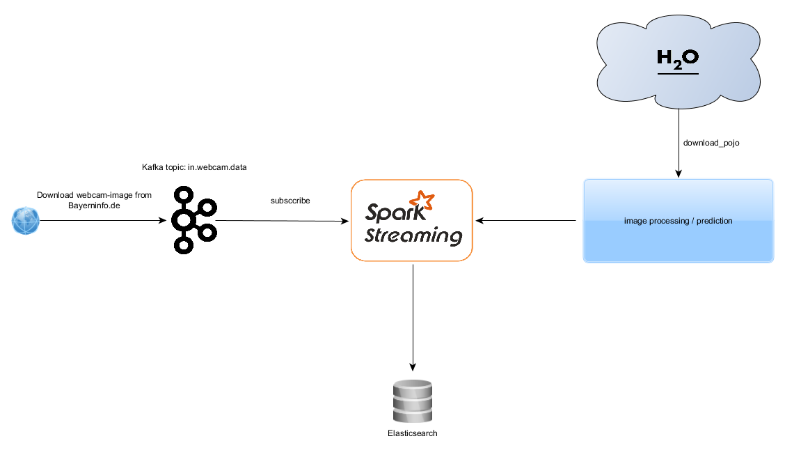

# "Nearly" Real-Time Traffic-Analysis

Traffic-Analysis is a sample application to show a possibility to use [H2O](https://www.h2o.ai/) in conjunction 
with [Spark Streaming](http://spark.apache.org/).

## Installation / Setup

To run this application, *Apache Kafka*, *Elasticsearch*, and *Kibana* must be installed.

### Apache Kafka 

1. Download Apache Kafka 0.10.2.0 from [https://kafka.apache.org/downloads](https://kafka.apache.org/downloads)
2. Start Zookeeper: zookeeper-server-start.bat ../../config/zookeeper.properties
3. Start Apache Kafka: kafka-server-start ../../config/server.properties
4. kafka-topics.bat --list --zookeeper localhost:2181
5. kafka-topics.bat --create --topic in.webcam.data --zookeeper localhost:2181 --partitions 1 --replication-factor 1
6. kafka-console-consumer.bat --bootstrap-server localhost:9092 --whitelist in.webcam.data

### ELK-Stack 

1. Download Elastisearch 5.2.2 from [https://www.elastic.co/downloads/elasticsearch](https://www.elastic.co/downloads/elasticsearch)
2. Donwload Kibana 5.2.2 from [https://www.elastic.co/downloads/kibana](https://www.elastic.co/downloads/kibana)
3. Start Elastisearch via elastisearch.bat in the bin folder.
4. Start Kibana via kibana.bat in the bin folder. 
5. Go to localhost:5601 and create a new index pattern "analysis*" via the management tab.
6. Via the visualize tab one can create a new Line chart, where the the timestamp t is on the
   X-Axis and *count*, i.e. the number of cars, is on the Y-Axis.

## Architecture

## Run

It is assumed that, according to the above description Kafka, Elasticsearch and Kibana are already running.

1. Start the *DataPublisher* class in order to send images from *BayernInfo* to the Kafka topic *in.webcam.data*.
2. Start the Spark Streaming Job *TrafficAnalysisApplication*.

## More Information
* You can contact Andreas Wittmann on any issue via [E-Mail](mailto:andreas.wittmann@bfft.de)
* Visit the company I'm working for [BFFT Gesellschaft für Fahrzeugtechnik mbH](https://www.bfft.de)
 
 